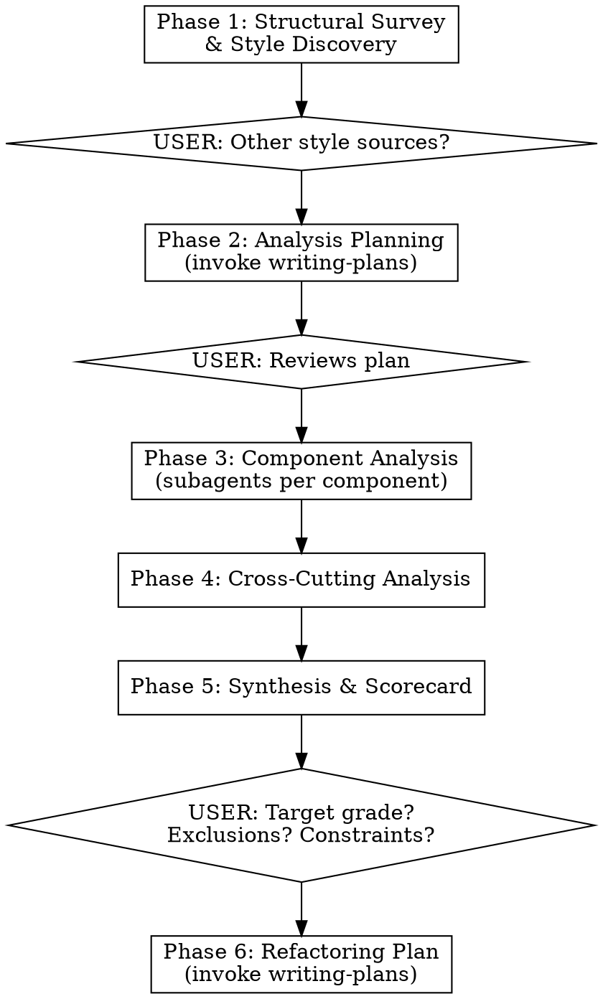

# Well-Factored Code Auditor

## Overview

**Announce at start:** "I'm using the well-factored-code-auditor skill to audit this codebase."

Systematic codebase factoring audit producing a graded scorecard and refactoring plan.

**Core test:** Well-factored code is easy to test. Hard-to-test code is a symptom of poor factoring.

**Factoring is discovery.** Extracting methods and objects uncovers hidden abstractions about the problem domain.

## The Seven Principles

1. **Clarity of Intent** — names reveal purpose; methods read as step lists
2. **Single Responsibility** — each unit does one thing; concerns separated
3. **DRY** — each concept expressed once; duplication signals missing abstraction
4. **YAGNI** — no speculative features; dead code removed
5. **Testability** — testable in isolation; dependencies injectable
6. **Test Adequacy** — critical paths tested; failures localize problems
7. **Consistency** — conventions uniform across the codebase

**Complexity** is a cross-cutting signal, not a separate principle. High cyclomatic complexity + long methods = primary refactoring targets.

## Workflow



**Phase 1 — Structural Survey & Style Discovery:** Map components, boundaries, dependencies, test infrastructure. Search for AGENTS.md, CLAUDE.md, CONTRIBUTING.md, linter/formatter configs (.swiftlint.yml, .eslintrc, .prettierrc, .editorconfig), IDE settings. **Survey only — do not assess or grade.** Present findings and ask: "Are there additional style sources I should consider? Any components to prioritize or exclude?"

**Phase 2 — Analysis Planning:** Prioritize components by risk/complexity. Produce analysis plan via `superpowers:writing-plans`. User reviews.

**Phase 3 — Component Analysis:** Dispatch subagents — one per component. Each assesses against the seven principles using `grading-rubric.md`. Output: strengths, findings by principle (with severity), complexity hotspots, dependencies.

**Phase 4 — Cross-Cutting Analysis:** Using component summaries, examine: DRY across boundaries, dependency direction, shared utility coverage, naming consistency, dead code across modules.

**Phase 5 — Synthesis & Scorecard:** Read `grading-rubric.md` for criteria and `scorecard-template.md` for output format. Grade each principle per component, then compute overall. Write `./docs/YYYY-MM-DD-well-factored-code-scorecard.md`. Present to user: "What grade are you targeting? Are there areas you'd like to exclude from refactoring? Any other constraints you want me to keep in mind?"

**Phase 6 — Refactoring Plan Handoff:** From scorecard findings, user's target grade, and constraints, produce a spec and invoke `superpowers:writing-plans`.

## Superpowers Dependency

This skill builds on the excellent [superpowers](https://github.com/obra/superpowers-marketplace) plugin by Jesse Vincent, whose disciplined approach to skill-driven AI workflows inspired our methodology. We're grateful for that foundation.

**At the start of the audit, check if `superpowers` skills are available** by looking for `superpowers:writing-plans` in the available skills list.

**If superpowers IS installed:** Use `superpowers:writing-plans` in Phases 2 and 6 as specified. Use `superpowers:executing-plans` for Phase 3 if the analysis plan warrants it.

**If superpowers is NOT installed:** Tell the user:
- Phases 1, 3, 4, and 5 work fully without superpowers
- Phase 2 (Analysis Planning) will produce a plan inline instead of using the structured writing-plans workflow — still functional but less rigorous
- Phase 6 (Refactoring Plan) will produce a prioritized list inline instead of a formal plan document — actionable but less structured
- Offer: "The superpowers plugin would improve the planning phases. Would you like instructions for installing it?"

**Install instructions (provide if asked):**
```bash
claude plugin marketplace add obra/superpowers-marketplace
claude plugin install superpowers@superpowers-marketplace
```

## Boundaries

- Splitting a short routine in half can reduce comprehension — factoring has practical limits
- Method length (~60-100 lines) is a ceiling, not a target
- Performance-critical code: make it work, make it right, make it fast — in that order

## Red Flags — STOP

- Skipping Phase 1 (structural survey) to "save time"
- Analyzing all components in one context window instead of using subagents
- Giving grades without citing evidence from specific files
- Combining analysis and refactoring planning into one step
- Producing free-form prose instead of following the scorecard template
- Skipping user checkpoints

**All of these mean: Go back to the phase you skipped.**

## References

- `grading-rubric.md` — letter grade scale, per-principle criteria, severity weighting, context calibration
- `scorecard-template.md` — exact output template with all required sections
