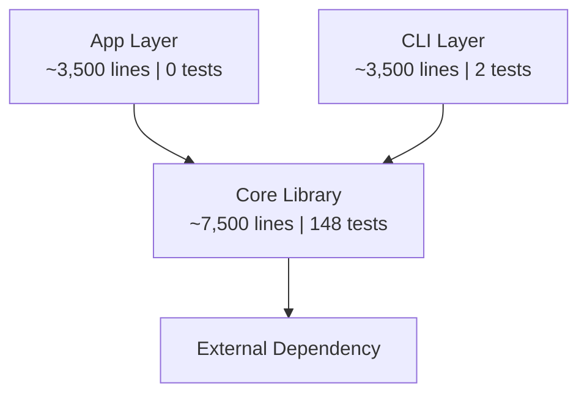

# Scorecard Template — Well-Factored Code Auditor

Use this template exactly when producing the scorecard output. Replace all `[bracketed]` placeholders with actual content.

---

```markdown
# Well-Factored Code Scorecard

Date: [YYYY-MM-DD]
Scope: [full codebase / specific components]
Auditor: agents4hire:well-factored-code-auditor

## Overall Grade: [A+ through F]

## Executive Summary

[2-3 paragraphs summarizing the codebase's factoring quality, key strengths, most pressing concerns, and recommended focus areas.]

## Grades by Principle

| Principle | Grade | Summary |
|---|---|---|
| Clarity of Intent | [grade] | [one-line summary] |
| Single Responsibility | [grade] | [one-line summary] |
| DRY | [grade] | [one-line summary] |
| YAGNI | [grade] | [one-line summary] |
| Testability | [grade] | [one-line summary] |
| Test Adequacy | [grade] | [one-line summary] |
| Consistency | [grade] | [one-line summary] |

## Grades by Component

| Component | Clarity | SRP | DRY | YAGNI | Testability | Test Adequacy | Consistency | Overall |
|---|---|---|---|---|---|---|---|---|
| [component-1] | [grade] | [grade] | [grade] | [grade] | [grade] | [grade] | [grade] | [grade] |
| [component-2] | [grade] | [grade] | [grade] | [grade] | [grade] | [grade] | [grade] | [grade] |
| [component-N] | [grade] | [grade] | [grade] | [grade] | [grade] | [grade] | [grade] | [grade] |

## Style Reference

[Summary of discovered coding style conventions, sources consulted (CLAUDE.md, linter configs, style guides, user input), and the working style reference used during analysis.]

## Architecture Overview

Use a Mermaid diagram to show component relationships, dependency directions, and key metrics. Example:



Follow the diagram with a brief assessment of whether the architecture delivers on its stated intent.

## Strengths

[Bulleted list of what the codebase does well. Be specific — cite examples.]

## Component Assessments

### [Component Name]

**Grade: [overall component grade]**

**Strengths:** [What this component does well]

#### Findings

| # | Principle | Description | Location(s) | Severity | Suggested Approach |
|---|---|---|---|---|---|
| 1 | [principle] | [description of finding] | [file:line references] | [high/medium/low] | [brief suggestion] |
| 2 | [principle] | [description] | [locations] | [severity] | [suggestion] |

#### Complexity Hotspots

| Method/Function | Cyclomatic Complexity | Lines | Test Coverage | Recommendation |
|---|---|---|---|---|
| [name] | [number] | [count] | [covered/partial/none] | [recommendation] |

[Repeat "### [Component Name]" section for each component]

## Cross-Cutting Findings

| # | Concern | Description | Components Affected | Severity | Suggested Approach |
|---|---|---|---|---|---|
| 1 | [concern type] | [description] | [list of components] | [high/medium/low] | [suggestion] |
| 2 | [concern type] | [description] | [components] | [severity] | [suggestion] |

## Severity Summary

| Severity | Count | Key Areas |
|---|---|---|
| High | [N] | [brief list of high-severity finding areas] |
| Medium | [N] | [brief list] |
| Low | [N] | [brief list] |

## Recommended Priority Order

[Ordered list of refactoring priorities, starting with highest-impact items. For each item, note which findings it addresses, expected grade impact, and any dependencies on other items.]

1. **[Priority item]** — Addresses findings [#, #]. Expected impact: [principle] grade [current] → [target]. [Dependencies if any.]
2. **[Priority item]** — ...
```
